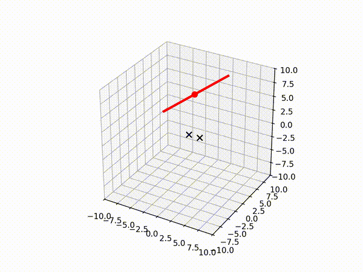

# Magnetic Field Source Localization with a Particle Filter

A particle filter that estimates 3D position and direction of a current carrying wire from three axis magnetic field measurements, using Biot-Savart law as the measurement model. Developed alongside a capstone project on remote underwater cable and pipe location. 

## Approach

The state of the wire is represented using its 3D position and 3D direction vector. Each particle proposes a hypothesis for the true location and direction of the cable. For every iteration the system takes in a magnetic field measurement and weights each particle based on how similar the estimated magnetic field reading is compared to the true reading. After weights are assigned, a new set particles are drawn from the probability distribution of weights making higher weighted particles more likely to be redrawn multiple times. Finally, propagation noise is added to prevent population collapse and weights are all reset to be uniform. 

Because a line in 3D space has no preferred point along its axis, particle positions are canonicalized onto the plane perpendicular to the particles direction vector at every step. This removes a redundant degree of freedom that would otherwise make the likelihood ill defined. 

## Results (static two sensor)

The current implementation uses two static sensors separated by a fixed baseline. Across 100 Monte Carlo trials with random wires:

- Median position error: 0.23 units
- Median direction error: 0.9 degrees
- 72% of trials converged within 1 unit and 5 degrees
- 43% of trials converged within 0.1 units and 1 degree

The remaining trials show a multimodal failure mode under symmetric sensor geometries, where two collinear sensors do not fully constrain the wire. Adding a third non collinear sensor would address this issue. 

## Development History

The project originally targeted a single moving sensor that would sweep across space and collect a sequence of measurements along its path. This approach naturally breaks ambiguities with the two sensor static localization since each movement constrains the wire from a different viewpoint. Two sweep geometries were prototyped:

Particle filter using two static sensors. Individual particles are not rendered due to animation file size; the blue arrow shows the mean estimated wire location.

Particle filter with linear sweep in three dimensions.

Particle filter with semicircle arc sweep in three dimensions.

When the sensor movement data proved unavailable from the capstone hardware, the formulation was reworked to use static sensors with a known baseline. This trades constraints of a sweep trajectory for a simpler setup that does not need to account for position telemetry at the cost of geometric failure mode as mentioned above. 

## Robustness to Sensor Position Drift

The sensor telemetry was ially going to be tracked using a 6 axis imu so small errors in positioning would compound over time. To verify the system would still function given this possibility of noise in the position data, drift was accounted for in the sweep simulations. 

## Running

`python3 main.py`

Requires numpy and matplotlib
